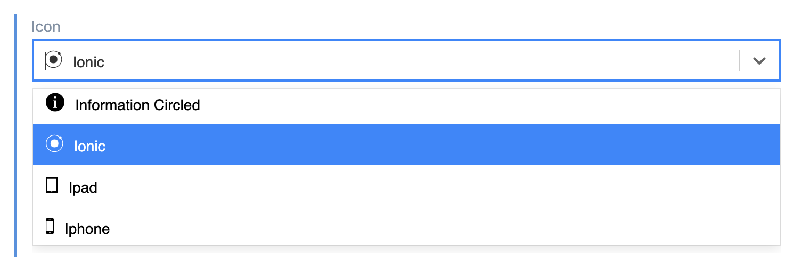
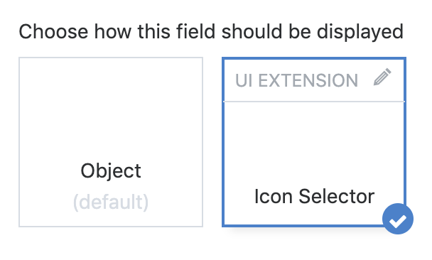

# ctf-uix-icon-selector
A Contentful UI extension that leverages react-select and a portion of the Ionicons 2.0.0 library.

[react-select on Github](https://github.com/JedWatson/react-select) 
[Ionicons on Github](https://github.com/ionic-team/ionicons) 
[Ionicons v2.0.0 Cheatsheet](https://ionicons.com/v2/cheatsheet.html)

## Description

You can install this extension into your Contentful space via the [Contentful Comand line tool](https://github.com/contentful/contentful-cli) or by utilizing the webapp [UI extension installer](https://www.contentful.com/developers/docs/concepts/uiextensions/). Full instructions on how to install an extension can be found in the [Contentful UI Extension Documentation](https://www.contentful.com/developers/docs/concepts/uiextensions/).

## How to Enable the Extension

To enable the extension go to a content type of your choice and add a new field of type `JSON`. In the appearance panel you can then find the `Icon Selector` option.

